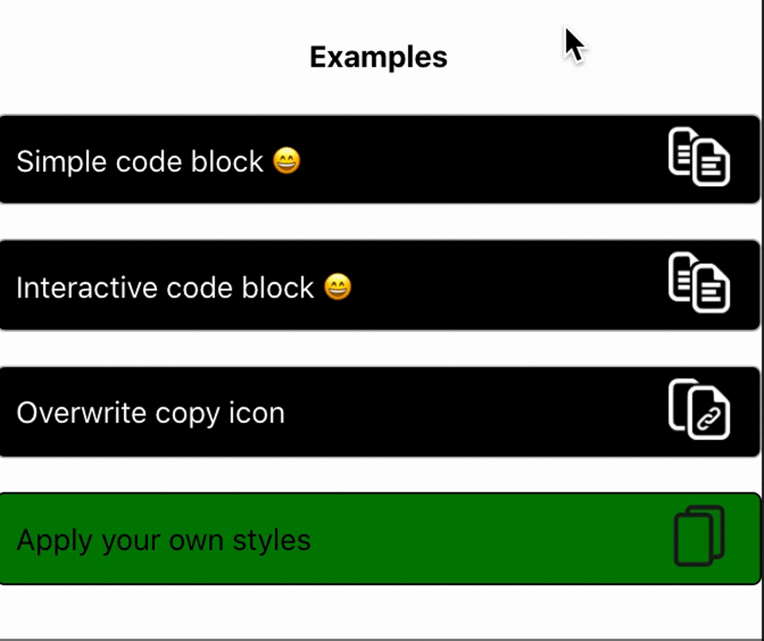

# React Interactive Code Block Component

[](https://www.npmjs.com/package/react-interactive-code-block) [](https://standardjs.com)[](https://raw.githubusercontent.com/mecm1993/react-interactive-code-block/master/LICENSE)
[](https://snyk.io/test/github/mecm1993/react-interactive-code-block)[](https://www.npmjs.com/package/react-interactive-code-block)

Reusable interactive code block component for React. Here you can find a [live demo](https://dockerexplorer.now.sh/).

## Install

```
npm install --save react-interactive-code-block

or

yarn add -D react-interactive-code-block
```

## Usage

```tsx
import CodeBlock from 'react-interactive-code-block'
import 'react-interactive-code-block/dist/index.css'

class Example extends Component {
  render() {
    return <CodeBlock
      message={'Interactive code block 😄'}
      typing
      speed={30}
      />
  }
}
```

## Props

| name              | type    | isRequired | default   | description                                              |
| ----------------- | ------- | ---------- | --------- | -------------------------------------------------------- |
| `message`         | string  | ✔          | N/A       | text shown in container                                  |
| `typing`          | bool    | ✖          | false     | typing effect                                            |
| `speed`           | number  | ✖          | -1        | velocity of the typing effect, requires `typing`         |
| `icon`            | string  | ✖          | [icon](https://rb.gy/c9wi3z)      | copy icon |
| `className`       | string  | ✖          | undefined | className of the container                               |
| `style`           | object  | ✖          | {}        | custom styles                                            |

## Examples



## License

[MIT]((https://raw.githubusercontent.com/mecm1993/react-interactive-code-block/master/LICENSE)) © mecm1993